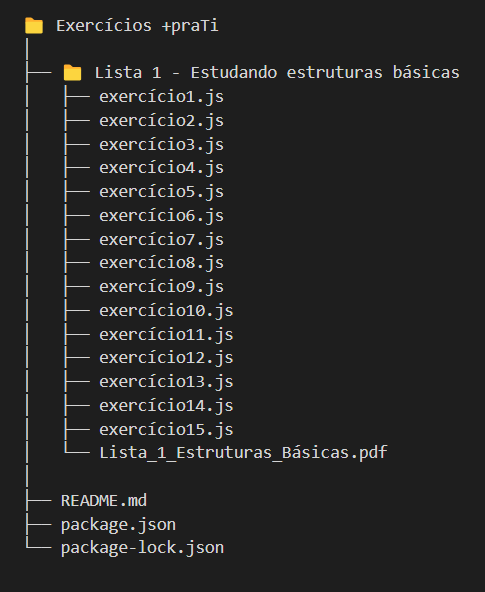

# Exercicios +praTi
## Pasta com a resolução dos exercícios propostos pela +praTi

Esse repositório contará com uma pasta para cada lista de exercicios obrigatórios que deverão ser entregues a +praTi.

 - **Estrutura básica**

 

**OBS: Ao clonar o repositóorio certfique - se de rodar o comando:** 
```
npm install
```
**Este comando permite instalar as dependencias do projeto** 

**No VSCode faça a instalação de uma extensão que permita a leitura do pdf com a lista de questões. Recomenda-se o [vscode-pdf](https://marketplace.visualstudio.com/items?itemName=tomoki1207.pdf).** 

**Caso não seja possivel, pode - se abrir o arquivo no leitor de pdf padrão do seu sistema operacional.**


